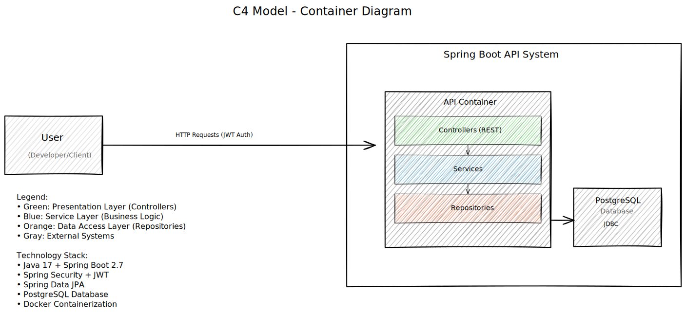

# PoC API - Java Spring Boot

This project is a Proof of Concept (PoC) API built using Java and the Spring Boot framework. Its main purpose is to demonstrate how to build an enterprise-grade API following best practices for structure, security, and scalability.

## How it Works (High-Level Architecture)

The API is structured in layers, making it organized and easy to maintain:



*   **Presentation Layer:** This is where the API endpoints are defined. It receives requests (like asking for product information or creating a new product) and sends back responses. It uses JWT (JSON Web Tokens) to ensure only authorized users can access certain parts of the API.
*   **Service Layer:** This layer contains the core "brain" of the application, handling all the business rules and logic. For example, when you request a product, the Presentation Layer asks the Service Layer to fetch it.
*   **Data Access Layer:** This layer talks directly to the database. It's responsible for storing and retrieving all the information (like product details or user accounts). We're using an in-memory H2 database for quick local development, but it's configured to easily switch to PostgreSQL for more robust environments.

## Features Demonstrated

*   **RESTful API:** Standard way of building web services.
*   **Spring Boot:** Framework for building robust Java applications quickly.
*   **Spring Security & JWT:** Secure user authentication and authorization.
*   **Layered Architecture:** Organized code for maintainability and scalability.
*   **H2 Database:** Lightweight, in-memory database for development.
*   **PostgreSQL Support:** Configured for easy transition to a production-ready database.
*   **Dockerization:** Ability to package the application into containers for easy deployment.

## Getting Started (for Developers)

To run this project:

1.  **Clone the repository:**
    ```bash
    git clone https://github.com/your_username/poc-api.git
    cd poc-api
    ```
2.  **Build and Run with Docker Compose (Recommended for full setup):**
    ```bash
    make up
    ```
    This will build the Docker image, start the application, and a PostgreSQL database.

3.  **Build and Run with Maven (if Docker is not preferred):**
    ```bash
    ./mvnw clean install
    java -jar target/poc-api-0.0.1-SNAPSHOT.jar
    ```

## How to Test the API

The application runs on port 8080 and is accessible from your host machine.

**Note:** Security is disabled for testing (`app.security.enabled=false`). No authentication required.

1.  **Get all products:**
    ```bash
    curl -X GET http://localhost:8080/api/v1/products
    ```

2.  **Create a new product:**
    ```bash
    curl -X POST -H "Content-Type: application/json" -d '{ "name": "New Product", "description": "A newly created product", "price": 99.99 }' http://localhost:8080/api/v1/products
    ```

3.  **Get product by ID (replace {id} with an actual product ID):**
    ```bash
    curl -X GET http://localhost:8080/api/v1/products/{id}
    ```

4.  **Update a product by ID (replace {id} and modify the body):**
    ```bash
    curl -X PUT -H "Content-Type: application/json" -d '{ "name": "Updated Product", "description": "This product has been updated", "price": 120.00 }' http://localhost:8080/api/v1/products/{id}
    ```

5.  **Delete a product by ID (replace {id}):**
    ```bash
    curl -X DELETE http://localhost:8080/api/v1/products/{id}
        ```

4.  **Testing in a Web Browser:**
    You can also access the API documentation via Swagger UI (if enabled and configured to serve HTML) by navigating to `http://localhost:8080/swagger-ui.html` (or similar path depending on configuration) in your web browser. This allows for interactive testing of the API endpoints.

## API Documentation

The API endpoints are documented using OpenAPI (Swagger). You can find the `openapi.yaml` file in the `docs` directory.
